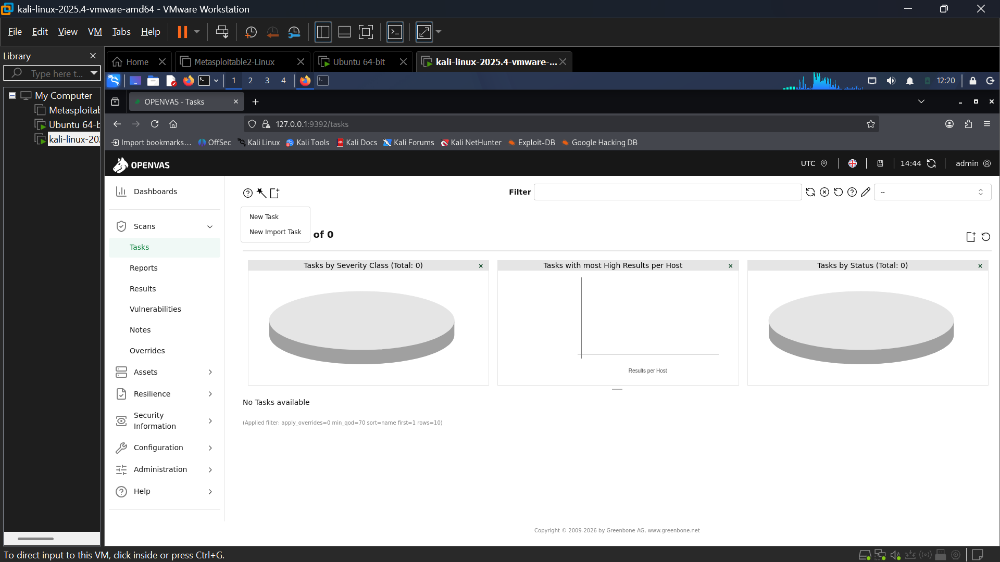

# VulnVision 360 — Continuous Compliance & Threat Exposure Engine

> **Project:** Continuous Compliance & Threat Exposure Engine  
> **Brand:** VulnVision 360  
> **Organization:** Infotact Solutions — Cyber Defense Operations Center (CDOC)  
> **Target Environment:** Internal subnet `192.168.91.0/24` | Ubuntu 18.04 Server (`192.168.91.136`)

---

## Project Overview

Legacy servers left unpatched for months represent a critical and growing attack surface. VulnVision 360 is a systematic, four-week engagement that maps the entire internal attack surface, prioritizes vulnerabilities by CVSS score, automates CIS Benchmark compliance checks, remediates identified issues, and produces executive-grade reporting — all following a closed-loop, evidence-based methodology.

**Core Capabilities:**
- **Authenticated Scanning** — SSH/SMB credential-based scanning to reveal internal software versions invisible to external attackers
- **Compliance Automation** — OpenSCAP-driven CIS Benchmark enforcement with machine-generated HTML reports
- **Risk Reporting** — Before/after PDF reports demonstrating measurable risk reduction

---

# Week 1 — INSTALLATION OF NMAP AND OPENVAS - PERFORM AGGRESSIVE SCAN 
```
Lab environment :-
Target: Ubuntu 18.04 LTS
Tool: Nmap
Scan Date: March 2, 2026
IP: 192.168.91.136
```
---

## What Was Done

### Installed `OPENVAS` and `NMAP` packages on the kali machine.

1. INSTALL BOTH PACKAGES
   > sudo apt install openvas nmap xsltproc

2. SETTING UP THE OPENVAS
    > sudo gvm-setup

3. CHECKING SETUP IS DONE OR NOT
    > sudo gvm-check-setup


#### NOTE:- During this you may encounter an error called collation version mismatch 
```
Solution :- 
          Step 1: Update PostgreSQL Template Database Collations
                      sudo -u postgres psql << EOF
                      ALTER DATABASE template0 REFRESH COLLATION VERSION;
                      ALTER DATABASE template1 REFRESH COLLATION VERSION;
                      ALTER DATABASE postgres REFRESH COLLATION VERSION;
                      EOF
          Step 2: Reindex Template Databases
                      sudo -u postgres psql template1 -c "REINDEX DATABASE template1;"
                      sudo -u postgres psql postgres -c "REINDEX DATABASE postgres;"
          Step 3: Create GVM PostgreSQL Database
                      sudo runuser -u postgres -- /usr/share/gvm/create-postgresql-database
```
4. After executing this command again run step-2 and step-3

5. STARTING GVM SERVICES
   > sudo gvm-start

---

## Now we will perform aggressive scan 


1. First we will run ping sweep scan on our entire network to find target machine ip
   > nmap -sn 192.168.91.0/24 -oN live_hosts.txt

2. Now run aggressive scan on target ip 
    > nmap -A -p- -T3 --script vuln 192.168.91.136 -oN nmap_report.txt -oX nmap_report.xml

      | Flag | Purpose |
      |------|---------|
      | `-A` | OS detection, version detection, script scanning, traceroute |
      | `-p-` | Scan all 65,535 TCP ports |
      | `-T3` | Timing template — controls scan speed (Normal) |
      | `--script vuln` | Run Nmap NSE vulnerability detection scripts |
      | `-oN` | Human-readable output |
      | `-oX` | XML output (required for HTML conversion) |

3. Now convert xml into html report through online xml template
    > xsltproc -o nmap_report.html bootstrap.xsl nmap_report.xml

---

## Now i will introduce you with my automation script 

1. Download [nmap.sh](WEEK-1/nmap.sh) and [bootstrap.xsl](WEEK-1/bootstrap.xsl) file
2. Give my script executable permission

    > sudo chmod +x nmap.sh
4. Now run my script with sudo permission

    > sudo ./nmap.sh YOUR-NETWORK-IP-WITH-CIDR

Note :- You can use this script with file contains target ips or more.
    
   > sudo ./nmap.sh target.txt

### 📝 Input File Format (targets.txt)
```
# Single IPs
192.168.1.1
192.168.1.5
10.0.0.1

# CIDR ranges
192.168.1.0/24
10.0.0.0/16

# IP ranges
192.168.1.1-50

# Hostnames
server1.example.com
```

### 📁 What It Produces

```
Results saved in: "result/"
                        ├── live_hosts.txt          (discovered live IPs)"
                        ├── nmap_report.txt         (detailed text report)"
                        ├── nmap_report.xml         (XML for parsing/tools)"
                        └── nmap_report.html        (interactive HTML report)"
```

## Evidence Files

| File | Description |
|------|-------------|
| [live_hosts.txt](WEEK-1/REPORTS/live_hosts_before.txt) | Contains live host ip in network range |
| [nmap_report.txt](WEEK-1/REPORTS/nmap_report_before.txt) | Contain Nmap scan result in TEXT format |
| [nmap_report.html](WEEK-1/REPORTS/nmap_report_before.html) | Contain Nmap scan result in HTML webpage format |
| [nmap_report.xml](WEEK-1/REPORTS/nmap_report_before.xml) | Contain Nmap scan result in XML format |
| [nmap.sh](WEEK-1/nmap.sh) | Automation script for nmap command  |
| [bootstrap.xsl](WEEK-1/bootstrap.xsl) | Act as a template to convert xml into html page |


## Gate Check Status

| Requirement | Status |
|-------------|--------|
| Nmap and Openvas installation | ✅ Complete |
| Perform pingsweep scan on network range | ✅ Complete |
| Perform aggressive scan on target system | ✅ Complete |
| Make detailed html report on network inventory  | ✅ Complete |
| Create automation script | ✅ Complete |

---


## Week 2 — Vulnerability Assessment

### Objective
Conduct unauthenticated and authenticated vulnerability scans. Compare results to show the internal vs. external risk gap. Identify at least one Critical CVE (CVSS 9.0+).

### Method

**Tool:** GVM/OpenVAS (web UI)

**Step 1 — Unauthenticated Scan**  
No credentials supplied. Simulates an external attacker who has gained network access but cannot log in to the target.

**Step 2 — Authenticated Scan**  
Configure SSH/SMB credentials in GVM. Scanner logs into target and checks local software versions, service configs, and internal settings invisible at the network layer.
```
Task: INFOTACT AUTHORIZED SCAN
Date: Mon Mar 2 16:24:48 – 16:58:19 UTC 2026
Target: 192.168.91.136
Auth: SMB Success (Port 445) | SSH Login Failure (Port 22, user: sysadmin)
```

## Kindly show this video for step-by-step process for authorized and unauthorized scanning. Click on image 
[](https://drive.google.com/file/d/13oiRit1PjAVD0P6R230T7MjyFA1VsnVy/view?usp=drive_link)


### Results — Before Remediation

| Severity | Count | Key Finding |
|----------|-------|-------------|
| **High** | 2 | SNMP Default Community Strings (CVSS 7.6), FTP Default Creds `admin:admin` (CVSS 7.5) |
| **Medium** | 7 | Telnet cleartext, FTP cleartext, HTTP TRACE, Weak SSH ciphers, Deprecated TLS 1.0/1.1, phpinfo() exposed, SSL Renegotiation DoS |
| **Low** | 3 | TCP Timestamps, Weak SSH MAC (hmac-md5), ICMP Timestamp disclosure |
| **Total** | **12** | (Before filtering: 227 results) |

**Top Risk Findings:**
1. **SNMP Default Community Strings** (`public`/`private`) — CVSS 7.6 — Write access grants remote administrative control
2. **FTP Default Credentials** (`admin:admin`) — CVSS 7.5 — Full FTP access with zero effort

## Evidence Files

| File | Description |
|------|-------------|
| [AUTHORIZED_SCAN.pdf](WEEK-2/REPORTS/AUTHORIZED_SCAN.pdf) | Contains Authorized scan report in pdf format |
| [UNAUTHORIZED_SCAN.pdf](WEEK-2/REPORTS/UNAUTHORIZED_SCAN.pdf) | Contains Unauthorized scan report in pdf format |
| [AUTHORIZED_SCAN.txt](WEEK-2/REPORTS/AUTHORIZED_SCAN.txt) | Contains Authorized scan report in txt format |
| [UNAUTHORIZED_SCAN.txt](WEEK-2/REPORTS/UNAUTHORIZED_SCAN.txt) | Contains Unauthorized scan report in txt format |
| [AUTHORIZED_SCAN.csv](WEEK-2/REPORTS/AUTHORIZED_SCAN.csv) | Contains Authorized scan report in csv format  |
| [UNAUTHORIZED_SCAN.csv](WEEK-2/REPORTS/UNAUTHORIZED_SCAN.csv) | Contains Unauthorized scan report in csv format |

## Gate Check Status

| Requirement | Status |
|-------------|--------|
| Unauthenticated scan | ✅ Complete |
| Authenticated scan | ✅ Partially Complete |
| Found High level vulnerability | ✅ Complete |
| Make html report  | ✅ Complete |
| Comparison between auth and unauth scan | ✅ Partially Complete |

---


## Week 3 — Compliance Automation

### Objective
Evaluate the target server against the CIS Benchmark Level 1 profile using OpenSCAP. Generate structured HTML reports documenting every non-compliant configuration.

### Method

**Tool:** `oscap` (OpenSCAP)  
**Profile:** `xccdf_org.ssgproject.content_profile_cis` (CIS Level 1 Server)  

### Installation of oscap and ssg security guide 

```
# Download openscap 
sudo apt install -y libopenscap8 openscap-utils openscap-scanner

# Check download properly done 
oscap --version

# Download SSG from GitHub releases
cd /tmp

# Get latest release (check https://github.com/ComplianceAsCode/content/releases)
wget https://github.com/ComplianceAsCode/content/releases/download/v0.1.72/scap-security-guide-0.1.72.zip

# Extract
unzip scap-security-guide-0.1.72.zip
cd scap-security-guide-0.1.72

# Create the standard directory and copy needed content 
sudo mkdir -p /usr/share/xml/scap/ssg/content/

sudo cp scap-security-guide-0.1.72/*.xml /usr/share/xml/scap/ssg/content/

# Set permissions
sudo chmod 644 /usr/share/xml/scap/ssg/content/*

# Verify files are there
ls /usr/share/xml/scap/ssg/content/ | grep ubuntu

# For verify cis profile
oscap info /usr/share/xml/scap/ssg/content/ssg-ubuntu1804-ds.xml

# here you can see like xccdf_org.ssgproject.content_profile_cis this profile. 
```

**Step 1 — CIS Level 1 Scan**
```
sudo oscap xccdf eval \
  --profile xccdf_org.ssgproject.content_profile_cis \
  --results /home/ubuntu/Desktop/cis_results.xml \
  --report /home/ubuntu/Desktop/cis_report.html \
  /usr/share/xml/scap/ssg/content/ssg-ubuntu1804-ds.xml
```

| Flag | Purpose |
|------|---------|
| `xccdf eval` | Evaluate system against an XCCDF checklist |
| `--profile` | Select cis_server benchmark profile  |
| `--results` | Save XML results  |
| `--report` | Generate HTML report |

**Step 2 — Standard Profile Scan**
```
sudo oscap xccdf eval \
  --profile xccdf_org.ssgproject.content_profile_standard \
  --results /home/ubuntu/Desktop/standard_results.xml \
  --report /home/ubuntu/Desktop/standard_report.html \
  /usr/share/xml/scap/ssg/content/ssg-ubuntu1804-ds.xml
```

### Key Non-Compliant Findings (Before Remediation)

**Results: 53 rules evaluated — 31 FAILED / 22 PASSED**

### 1. SSH Permitting Empty Passwords — CIS 5.2.11 ❌
```
Current:  PermitEmptyPasswords yes
Required: PermitEmptyPasswords no
Risk:     Any account without a password can authenticate over SSH with no credentials
Fix:      sed -i 's/PermitEmptyPasswords yes/PermitEmptyPasswords no/' /etc/ssh/sshd_config
```

### 2. Weak Password Hash Exposure — CIS 6.1.4 ❌
```
Current:  /etc/shadow has incorrect permissions (readable beyond root)
Required: chmod 640 /etc/shadow, owned root:shadow
Risk:     Password hashes exposed — offline cracking attack possible
Fix:      chmod 640 /etc/shadow && chown root:shadow /etc/shadow
```

### 3. Other Notable SSH Failures
| Rule | CIS ID | Current | Required |
|------|--------|---------|----------|
| Disable SSH Root Login | 5.2.10 | PermitRootLogin yes | PermitRootLogin no |
| Limit Auth Attempts | 5.2.7 | MaxAuthTries 20 | MaxAuthTries 4 |
| Enable Warning Banner | 5.2.16 | No banner | Banner /etc/issue.net |
| Disable Host-Based Auth | 5.2.9 | Not configured | HostbasedAuthentication no |
| Session Timeout | 5.2.13 | Not set | ClientAliveInterval 300 |

## Evidence Files

| File | Description |
|------|-------------|
| [cis_report.html](WEEK-3/REPORTS/cis_report_before.html) | OpenSCAP HTML compliance report  |
| [cis_results.xml](WEEK-3/REPORTS/cis_results_before.xml) | Raw XCCDF scan results |
| [standard_report.html](WEEK-3/REPORTS/standard_report.html) | Standard profile scan  |
| [standard_results.xml](WEEK-3/REPORTS/standard_results.xml) | Raw XCCDF results — standard profile |

## Gate Check Status

| Requirement | Status |
|-------------|--------|
| oscap installed on test Linux server | ✅ Complete |
| Scanned against CIS Server Level 1 & standard profile | ✅ Complete |
| Generated structured HTML compliance report | ✅ Complete |
| Found critical ssh and other vulnerability  | ✅ Confirmed (CIS 5.2.11 FAIL) |
| Found ftp and other vulnerability | ✅ Confirmed (CIS 6.1.4 FAIL) |

---

## Week 4 — Remediation & Closed-Loop Verification

### Objective
Auto-generate and execute remediation scripts from scan results. Re-scan to verify closure. Produce final executive comparison showing measurable risk reduction.

### Installation of ansible packages
```
sudo apt install ansible -y
```
### Method - 1 Automated bash script file for remediation

```
# Step 1 — Auto-Generate Remediation Bash Script
oscap xccdf generate fix \
  --fix-type bash \
  --output cis_remediation.sh \
  --result-id xccdf_org.open-scap_testresult_xccdf_org.ssgproject.content_profile_cis \
  cis_results.xml

# Step 2 — Execute Remediation

chmod +x cis_remediation.sh
sudo ./cis_remediation.sh

# Note :- automated bash script generated by me to fix some critical vulnerability exist in nmap and openvas results.
sudo ./other_remediation.sh
```
#### OpenSCAP reads the XML results from Week 3 and generates a targeted bash script — only fixing rules that **failed**. No manual scripting needed.

## Method - 2 Automated Ansible playbook for remediation

Step 1 — Generate Ansible Playbook 
```
oscap xccdf generate fix \
  --fix-type ansible \
  --output cis_remediation.yml \
  --result-id xccdf_org.open-scap_testresult_xccdf_org.ssgproject.content_profile_cis \
  cis_results.xml
```
For multi-host production environments: idempotent, repeatable, scalable.

Step 2 - Make inventory file for ansible to login ssh and other.
```
nano ~/inventory.ini
```
Add your host according this template 
```
[ubuntu_target]
192.168.91.136

[ubuntu_target:vars]
ansible_user=root
ansible_password=toor
ansible_ssh_common_args='-o StrictHostKeyChecking=no'
```
Step 3 - Check connection through ansible 
```
ansible -i ~/inventory.ini ubuntu_target -m ping
```
Note :- If you see SUCCESS in your Step-3 then move to Step-4 only.

Step 4 - Run actual playbook for remediation 
```
ansible-playbook -i ~/inventory.ini cis_remediation.yml
```

### Re-Scan Nmap , Openvas , Oscap result again and compare them.

## Comparison Before vs After Remediation of oscap cis_level_1 profile 

|Status| Before |  After  |  Change  |
|------|--------|---------|----------|
|Failed| 31|10|✅ -21 fixed|
|Passed| 22|43| +21|

#### Remaining 10 Failures — All Expected Because environment is in virtual machine OR needed manual action to prevent service disruption

|#|Rule|Why It Can't Be Auto-Fixed|
|---|------|---------------------------|
|1|Ensure /home on separate partition|Requires disk repartition|
|2|Ensure /tmp on separate partition|Requires disk repartition|
|3|Ensure /var on separate partition|Requires disk repartition|
|4|Ensure /var/log on separate partition|Requires disk repartition|
|5|Ensure /var/log/audit on separate partition|Requires disk repartition|
|6|Ensure /var/tmp on separate partition|Requires disk repartition|
|7|Verify Permissions on Backup passwd File|/etc/passwd- backup file perms|
|8|Verify Permissions on Backup shadow File|/etc/shadow- backup file perms|
|9|Disable core dump backtraces|Needs manual systemd config|
|10|Disable storing core dump|Needs manual systemd config|

## Critical vulnerability fixed by my bash script 

|#|Vulnerability|Status|
|---|------|---------------------------|
|0|Old version of packages and application | ✅ Fixed|
|1|SNMP default community strings|✅ Fixed|
|2|FTP default credentials (admin:admin)|✅ Fixed|
|3|Telnet cleartext login|✅ Fixed (via xinetd + UFW)|
|4|FTP no TLS|✅ Fixed|
|5|HTTP TRACE enabled|✅ Fixed|
|6|phpinfo() exposed|✅ Fixed|
|7|Weak SSH ciphers|✅ Fixed|
|8|Weak SSH MACs|✅ Fixed|
|9|TLS 1.0/1.1 on MySQL|✅ Fixed|
|10|SSL renegotiation DoS|✅ Fixed|
|11|TCP timestamps|✅ Fixed|
|12|ICMP timestamps|✅ Fixed|

## Evidence Files

| File | Description |
|------|-------------|
| [cis_remediation.sh](WEEK-4/cis_remediation.sh) | cis_level_1 remediation bash script  |
| [cis_remediation.yml](WEEK-4/cis_remediation.yml) | cis_level_1 remediation playbook |
| [other_remediation.sh](WEEK-4/other_remediation.sh) | Other remediation bash script  |
| [Final PDF report](WEEK-4/Final_report.pdf) | Final PDF report |
| Re-scan output file | uploaded in week wise folder |

## Gate Check Status

| Requirement | Status |
|-------------|--------|
| Ansible installation | ✅ Complete |
| Automated generate playbook and bash file | ✅ Complete |
| Executing remediation file | ✅ Complete |
| Re-Scan Nmap, Openvas, OScap and generate report  | ✅ Complete  |
| Comparison Before and After scan result | ✅ Complete  |

## Final Executive Summary

| Metric | Value |
|--------|-------|
| Subnet Scanned | `192.168.91.0/24` |
| Primary Target | `192.168.91.136` (Ubuntu 18.04) |
| Initial Findings | 12 (2 High, 7 Medium, 3 Low) AND 31 Failed in oscap |
| Final Findings | 2 (0 High, 2 Medium, 0 Low) AND 10 Failed in oscap |
| **Risk Reduction** | **83% decrease in total findings** |
| Critical Closures | SNMP default creds ✅ · FTP default creds ✅ · Telnet ✅ · Weak SSH ciphers ✅ |
| CIS Compliance | Automated via OpenSCAP + generated fix scripts |
| Residual Risk | FTP cleartext (CVSS 4.8), HTTP TRACE (CVSS 5.8) — mitigations planned |

---

## Tools Used

| Tool | Purpose | Week |
|------|---------|------|
| `nmap 7.98` | Host discovery, port scanning, OS detection, vuln scripts | 1 |
| `xsltproc` | XML-to-HTML report conversion | 1 |
| GVM / OpenVAS | Unauthenticated + authenticated vulnerability scanning | 2, 4 |
| `oscap` (OpenSCAP) | CIS Benchmark compliance evaluation | 3, 4 |
| Bash | Automated remediation scripting | 4 |
| Ansible (optional) | Multi-host production remediation | 4 |

---

## Final Directive

> *"In the dynamic field of Cybersecurity, you are only as strong as your weakest configuration. Diligence in documentation is paramount. Document every rule, every policy, every firewall exception, and every port you open."*
>
> **Trust No One. Verify Everything.**


